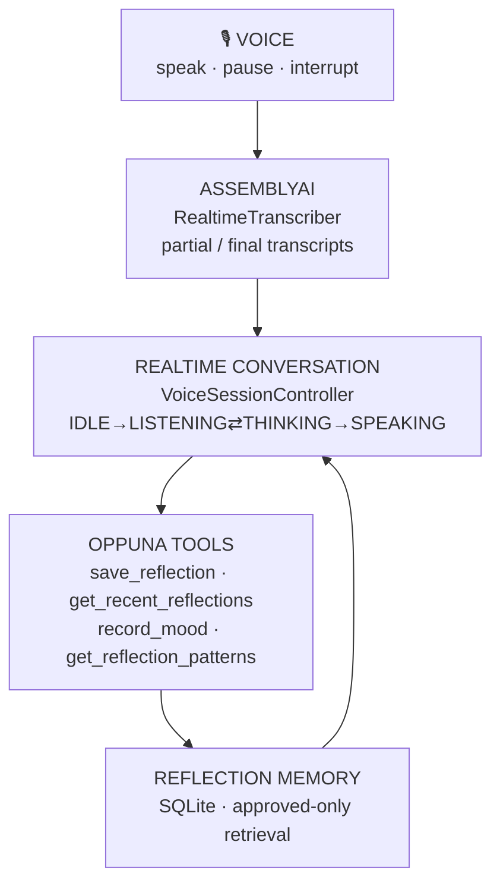

# Oppuna 🌿 — with Oppuna Voice 🎙️

**Private mental wellness support, offline on your phone — now with a voice-first reflection companion.**

> **Oppuna Voice** — “A voice-first reflection companion that turns natural conversations into user-controlled memories and meaningful reflections.” Built for the AssemblyAI Voice Agent Hackathon.

> **Important medical disclaimer**
> Oppuna is not a doctor, therapist, crisis service, or medical device. It does not diagnose, treat, cure, prevent, or replace professional care. It provides supportive wellness guidance only. If you are in danger or need medical help, contact your local emergency services right away.

---

## Oppuna Voice — Problem

Journaling helps people process stress, but blank pages and chat boxes feel like work — especially after an exhausting day. Traditional voice features (“record → stop → upload → wait”) break the natural flow of talking things through, and most AI companions silently absorb everything you say into opaque long-term memory.

## Solution

**Talk to Oppuna**: one tap from Home (or the Chat header) into a dedicated full-screen voice experience. Speak naturally — pause, correct yourself, interrupt — and Oppuna listens, responds, and later shapes the conversation into a reflection **you review, edit, and approve**. Only the memories you explicitly check become part of future conversations.

## Why voice

Talking is lower-friction than typing when you are drained. Natural turn-taking (pauses, barge-in, self-correction) keeps the emotional thread intact instead of forcing you to compose messages. Voice meets people where they are: tired, on a walk, winding down.

## Why AssemblyAI

Realtime transcription is the foundation of the whole experience: partial transcripts render live, final transcripts become conversation turns, and interruption works because the turn boundary is detected in realtime. AssemblyAI’s streaming speech-to-text (`RealtimeTranscriber`: `connect` → `sendAudio` → `transcript.partial`/`transcript.final` → `close`, authenticated with short-lived server-minted tokens) sits behind a clean `AssemblyAIVoiceService` adapter — first-class, swappable, and never holding long-lived secrets in the client. Without a token configured, the same pipeline runs fully on-device so the demo never hard-fails.

## Architecture



See [docs/VOICE_ARCHITECTURE.md](docs/VOICE_ARCHITECTURE.md) for the full architecture (discovered system, state machine, schema, plan).

## Features (voice)

- **Talk to Oppuna** (`src/screens/voice/TalkToOppunaScreen.tsx`) — full-screen orb that reacts to LISTENING / THINKING / SPEAKING, subtle live transcript, interrupt button, deterministic states, recovery from every error.
- **Natural turn-taking** — realtime partials update in place, finals replace them (no duplicates), barge-in stops speech immediately and preserves context.
- **Reflection flow** — “Turn this into a reflection” → preview (mood, summary, themes, commitments, excluded topics) → edit → save. Saying “don’t include the part about my manager” strips it before anything is saved.
- **User-controlled memory** — “What should Oppuna remember?” checklist: approve / reject / edit per item, save-without-memory, delete later. Only approved rows are ever retrieved.
- **Session 2 wow moment** — approved memories are retrieved into the next conversation (“Last time you mentioned…”), generated from real stored context, never hardcoded.
- **Patterns** — “How have I been doing lately?” aggregates real saved reflections (7d/30d); honest “not enough data” when history is thin.
- **Forget this conversation** — deletes session transcript + unsaved draft + candidates; approved unrelated memories are always kept.
- **“How Oppuna Voice works”** — expandable judge-friendly pipeline diagram on the voice screen.
- **Demo mode** (dev only) — seeds one clearly-labelled `[DEMO]` reflection; live conversation is never faked.

## User-controlled memory

Session context (transcript) ≠ long-term memory. Raw conversation never auto-persists as memory: `save_reflection` stores candidates **unapproved**, the user checks exactly what to keep, and `get_recent_reflections` returns **approved-only** rows. Rejected items are never retrieved.

## Privacy model

Oppuna is offline-first: `networkGuard` blocks all remote traffic by default. Voice is the single opt-in exception — tapping “Talk to Oppuna” shows a consent notice and enables a **session-scoped** allowlist for `*.assemblyai.com` (+ the token endpoint) only; it is revoked on session end. No API keys ship in the client (short-lived server-minted tokens via `scripts/voice-token-server.js`); `.env.example` holds placeholders only.

## Safety

Voice reuses the existing `safetyEngine` gate **before** any reply: crisis input short-circuits to the scripted crisis reply and the existing Crisis screen. Voice makes no diagnoses, claims no medical benefits, and never weakens existing safety behavior. Oppuna is a reflection companion — not an AI therapist.

---

## Tech stack

- React Native `0.83` + Expo SDK `55` + TypeScript (strict)
- `expo-sqlite` for local, structured storage (migration 4: `voice_sessions`, `reflections`, `reflection_memories`)
- `assemblyai@^4` (RealtimeTranscriber) behind `src/voice/AssemblyAIVoiceService.ts`
- `expo-speech` (interruptible TTS), `expo-audio` (mic permission + streaming)
- `zustand` for preferences state (persisted via AsyncStorage)
- `@react-navigation` (native-stack + bottom-tabs)
- `react-native-reanimated` + `react-native-svg` for animations and charts
- `llama.rn` for fully local GGUF inference on mobile builds (install-time Play Asset Delivery on Android; no Ollama)

See [docs/LOCAL_LLM_ANDROID.md](docs/LOCAL_LLM_ANDROID.md) for the on-device LLM architecture, PAD setup, and release workflow.

---

## Project structure

```
src/
  app/          App composition root + bootstrap
  components/   Reusable design system (ui/) and domain components (domain/)
  constants/    App metadata, disclaimers, crisis resources, moods
  database/     SQLite client, schema/migrations, repositories
  hooks/        useTheme, useTranslation, useHaptics, useAppNavigation
  i18n/         Locales (en/es/hi) + translator
  navigation/   Root navigator, tabs, types, navigation theme
  screens/      All screens, grouped by feature (voice/ → TalkToOppuna)
  services/     offlineAI, networkGuard, dataExport
  store/        Zustand settings store
  theme/        Tokens, colors, ThemeProvider
  types/        Domain models + Result type
  utils/        id, date, logger
  voice/        AssemblyAI adapter, session controller, tools, memory store
scripts/
  voice-token-server.js   Short-lived AssemblyAI token endpoint (server-side)
```

---

## Installation

```bash
npm install
```

## Environment variables

Copy placeholders (never commit secrets):

```bash
cp .env.example .env
```

| Variable | Purpose |
| --- | --- |
| `EXPO_PUBLIC_VOICE_TOKEN_URL` | Token endpoint base URL (e.g. `http://localhost:8787`). Empty = fully on-device fallback. |
| `EXPO_PUBLIC_VOICE_DEMO_MODE` | `1` enables the judge demo seed toggle (dev builds only). |

Server side (`scripts/voice-token-server.js`): `ASSEMBLYAI_API_KEY`, `VOICE_TOKEN_TTL_SECONDS` (default 900), `PORT` (default 8787).

## Running the application

```bash
npx expo start
```

Then press `i` (iOS simulator), `a` (Android emulator), or scan the QR code with Expo Go / a development build. The app runs fully offline once installed; only “Talk to Oppuna” with a token URL configured uses the network (after explicit consent).

Optional local token server (separate terminal):

```bash
ASSEMBLYAI_API_KEY=aai_... PORT=8787 node scripts/voice-token-server.js
```

## Type-check, lint, and test

```bash
npm run typecheck
npm run lint
npm run test
```

Unit tests cover the offline AI engine, Llama mental health agent, crisis detection, mood/journal storage logic — plus the voice suite (`src/voice/__tests__`: reflection creation, memory approval, rejected-memory exclusion, excluded-topic stripping, approved-only retrieval, interruption transitions, duplicate tool-call protection, forget behavior) and the voice network-guard exception.

## Demo flow (90 seconds)

1. **Home → “Talk to Oppuna”** (0:00) — consent, orb breathes, “Listening…”.
2. **Session 1** (0:10) — “Today was exhausting. I had an argument at work and I haven’t been able to stop thinking about it.” Live transcript appears; Oppuna responds conversationally.
3. **Interrupt** (0:30) — talk over Oppuna: “Wait, that’s not really what bothered me.” Speech stops instantly, context kept.
4. **Reflection** (0:45) — “Turn this into a reflection” → “Yes, but don’t include the part about my manager.” Preview excludes it. Check 2 memories, uncheck 1, Save.
5. **Session 2** (1:05) — new conversation: “I’ve been stressed again.” Oppuna: “Last time you mentioned having difficulty switching off after work…” — from approved memory.
6. **Patterns + Forget** (1:20) — “How have I been doing lately?” shows real 7-day data; “Forget conversation” wipes the transcript, keeps approved memories.

## Screenshots

> Placeholders — capture on a real device before submitting:
>
> - `docs/pitch-assets/voice-01-orb-listening.png` — orb in LISTENING with live transcript
> - `docs/pitch-assets/voice-02-reflection-preview.png` — “Today’s Reflection” preview
> - `docs/pitch-assets/voice-03-memory-approval.png` — “What should Oppuna remember?” checklist
> - `docs/pitch-assets/voice-04-patterns.png` — LAST 7 DAYS patterns card

## Future roadmap

- Stream mic PCM to AssemblyAI from `expo-audio` recordings on-device (currently typed-streaming fallback when no token; live mic path activates with token URL).
- On-device diarization / speaker labels for shared-device households.
- Encrypted local storage (SQLCipher / secure keys) for reflections.
- Export reflections to the existing journal with user consent.

---

## Database schema

SQLite database `oppuna.db`, versioned with `PRAGMA user_version`. See `src/database/schema.ts`.

| Table | Key columns |
| --- | --- |
| `mood_entries` | `id`, `mood`, `intensity`, `note`, `tags` (JSON), `created_at` |
| `journal_entries` | `id`, `kind`, `title`, `body`, `created_at`, `updated_at` |
| `chat_sessions` | `id`, `title`, `created_at`, `updated_at` |
| `chat_messages` | `id`, `session_id` (FK → `chat_sessions`), `role`, `content`, `intent`, `mood`, `created_at` |
| `breathing_sessions` | `id`, `pattern`, `cycles`, `duration_sec`, `completed`, `created_at` |
| `safety_events` | `id`, `category`, `created_at` (metadata only — never the message text) |
| `voice_notes` | `id`, `uri`, `duration_sec`, `transcript`, `created_at` |
| `voice_sessions` | `id`, `created_at`, `ended_at`, `transcript_json`, `status` (ephemeral session context) |
| `reflections` | `id`, `session_id`, `summary`, `mood`, `themes/concerns/positive_moments/commitments/excluded_topics` (JSON), `user_approved`, `is_demo`, `created_at` |
| `reflection_memories` | `id`, `reflection_id` (FK), `text`, `approved`, `created_at`, `updated_at` (only `approved = 1` retrieved) |

---

## Features

- **Offline AI companion** — a safety-first chat pipeline with crisis detection, an on-device local LLM (`llama.rn` + llama.cpp + GGUF via Play Asset Delivery), streaming replies, and a deterministic rule-based fallback.
- **Crisis safety flow** — detects suicide, self-harm, abuse, violence, medical emergencies, and severe panic, then stops normal coaching and shows a dedicated crisis support screen.
- **Mood tracker** — mood, 1–10 intensity, notes, tags, history, and weekly insights with a local chart.
- **Journal** — daily, gratitude, thought records, trigger reflections, and private notes with search and edit/delete.
- **Breathing exercises** — 4-4-6, box breathing, and a 5-minute calm session with an animated breathing circle and completion screen.
- **Grounding** — guided 5-4-3-2-1 senses exercise.
- **Sleep support** — wind-down checklist, gentle reminders, and a spoken wind-down (device TTS).
- **Voice mode** — device text-to-speech and offline local voice notes, plus the new voice-first **Talk to Oppuna** reflection companion (AssemblyAI realtime + user-approved memory).
- **Self-care plan**, **Insights dashboard**, **Settings**, **Data export**, and **Delete all data**.
- **Dark/light/system themes**, **multilingual-ready architecture** (English, Spanish, Hindi included), accessibility support, haptics, and a reusable design system.

---

## Tech stack

- React Native `0.83` + Expo SDK `55` + TypeScript (strict)
- `expo-sqlite` for local, structured storage
- `zustand` for preferences state (persisted via AsyncStorage)
- `@react-navigation` (native-stack + bottom-tabs)
- `react-native-reanimated` + `react-native-svg` for animations and charts
- `expo-speech`, `expo-audio`, `expo-haptics`, `expo-file-system`, `expo-sharing`, `expo-localization`, `expo-secure-store`
- `llama.rn` for fully local GGUF inference on mobile builds (install-time Play Asset Delivery on Android; no Ollama)

See [docs/LOCAL_LLM_ANDROID.md](docs/LOCAL_LLM_ANDROID.md) for the on-device LLM architecture, PAD setup, and release workflow.

---

## Project structure

```
src/
  app/          App composition root + bootstrap
  components/   Reusable design system (ui/) and domain components (domain/)
  constants/    App metadata, disclaimers, crisis resources, moods
  database/     SQLite client, schema/migrations, repositories
  hooks/        useTheme, useTranslation, useHaptics, useAppNavigation
  i18n/         Locales (en/es/hi) + translator
  navigation/   Root navigator, tabs, types, navigation theme
  screens/      All 18 screens, grouped by feature
  services/     offlineAI, networkGuard, dataExport
  store/        Zustand settings store
  theme/        Tokens, colors, ThemeProvider
  types/        Domain models + Result type
  utils/        id, date, logger
```

---

## Installation

```bash
npm install
```

## Run

```bash
npx expo start
```

Then press `i` (iOS simulator), `a` (Android emulator), or scan the QR code with Expo Go / a development build. The app runs fully offline once installed.

## Type-check, lint, and test

```bash
npm run typecheck
npm run test
```

Unit tests cover the offline AI engine, Llama mental health agent, crisis detection, and the mood/journal storage logic.

---

## Database schema

SQLite database `oppuna.db`, versioned with `PRAGMA user_version`. See `src/database/schema.ts`.

| Table | Key columns |
| --- | --- |
| `mood_entries` | `id`, `mood`, `intensity`, `note`, `tags` (JSON), `created_at` |
| `journal_entries` | `id`, `kind`, `title`, `body`, `created_at`, `updated_at` |
| `chat_sessions` | `id`, `title`, `created_at`, `updated_at` |
| `chat_messages` | `id`, `session_id` (FK → `chat_sessions`), `role`, `content`, `intent`, `mood`, `created_at` |
| `breathing_sessions` | `id`, `pattern`, `cycles`, `duration_sec`, `completed`, `created_at` |
| `safety_events` | `id`, `category`, `created_at` (metadata only — never the message text) |
| `voice_notes` | `id`, `uri`, `duration_sec`, `transcript`, `created_at` |

Preferences (theme, language, onboarding/disclaimer flags, app-lock flag) are stored locally via AsyncStorage through the Zustand `settingsStore`.

---

## Security & privacy

- **Network guard** (`src/services/networkGuard.ts`) wraps `fetch` and `XMLHttpRequest` and rejects any outbound request to a remote host. In production no code path can reach the internet except the explicit, session-scoped “Talk to Oppuna” voice exception (`*.assemblyai.com` + token host, consent-gated, revoked on session end); local dev tooling is allowed only under `__DEV__`.
- No login, no cloud sync, no analytics, no tracking.
- **Export** writes a local JSON file and uses the OS share sheet (user-controlled). **Delete all data** wipes every table and removes recorded voice files.
- App-lock is included as a preference placeholder, ready for device biometrics in a future update.

## Roadmap-ready

The architecture is intentionally ready to grow into:

- bundling and lifecycle UX for on-device GGUF models behind the existing Llama agent,
- live mic PCM streaming to AssemblyAI from on-device recordings,
- encrypted local storage (SQLCipher / secure keys).

See `docs/PRIVACY.md` and `docs/APP_STORE.md` for the privacy statement and store description draft.
