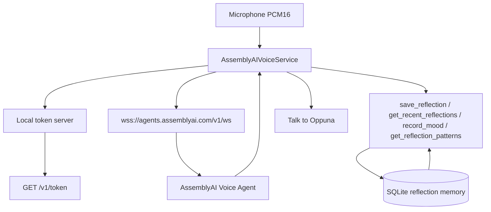

# Oppuna Voice

A voice-first reflection companion that turns natural conversations into user-controlled memories and meaningful reflections.

Oppuna Voice is the AssemblyAI hackathon experience inside Oppuna. You tap **Talk to Oppuna**, speak naturally, interrupt, correct yourself, and decide exactly what is allowed to be remembered. The rest of Oppuna — journal, mood check-ins, breathing, and the on-device companion — still runs locally and is unchanged.

Oppuna is a reflection and wellness companion. It is not a therapist, a doctor, a diagnostic system, or emergency services.

## Problem

Typing a journal entry asks people to organize a feeling before they have understood it. A text box also makes turn-taking awkward: you record a clip, stop, wait, and then read a reply. Sensitive details are easy to store by accident, and a later conversation has no careful way to recall only what you meant to keep.

## Solution

Talk to Oppuna is one full-screen conversation.

You speak. AssemblyAI handles realtime speech recognition, turn detection, the spoken reply, and barge-in. Oppuna’s tools turn that conversation into a structured reflection. Nothing from the raw transcript becomes long-term memory until you approve individual lines. The next conversation can retrieve only those approved lines.

## Why voice

Voice lets someone pause, continue, and change their mind without managing a recorder. Interrupting Oppuna mid-sentence is part of the product: playback stops, the correction is kept, and the conversation continues.

## Why AssemblyAI

AssemblyAI’s Voice Agent API is the conversation itself, not a plugin beside it. One WebSocket carries microphone audio in and spoken audio out. The same session emits partial transcripts, final transcripts, turn boundaries, barge-in, and tool calls. Oppuna does not stitch together a separate speech-to-text vendor, language model, and text-to-speech vendor for this flow.

## Architecture



The API key stays on `server/voice-token-server.mjs`. The app receives a one-time token and connects with `?token=`. Session setup is an inline `session.update` with the system prompt, client-side tools, PCM input and output, and barge-in enabled.

Journaling, mood history, and the on-device Llama companion do not use this socket. Android production builds still block `INTERNET`. The live voice demo runs in Expo web or Expo Go, where the process can reach the token server and AssemblyAI.

Details: [docs/VOICE_ARCHITECTURE.md](docs/VOICE_ARCHITECTURE.md).

## Features

- One button, **Talk to Oppuna**, from Home and Chat.
- Realtime listening, partial transcripts, and spoken replies. No press-to-record loop.
- Barge-in: user speech stops playback and the interrupted reply cannot overwrite the next one.
- Tools: `save_reflection`, `get_recent_reflections`, `record_mood`, `get_reflection_patterns`.
- Reflection preview with mood, summary, themes, realization, and an optional commitment.
- Pattern lines only when at least two approved reflections exist in the window.
- Optional dev control to seed labeled historical reflections. It does not fake a live AssemblyAI reply.
- Expandable “How Oppuna Voice works” on the voice screen.

## User-controlled memory

After a reflection is drafted, Oppuna asks what it should remember. Each suggestion can be kept, edited, or left unchecked. Saving the reflection does not require saving any memory. Later conversations call `get_recent_reflections` and receive only approved lines. Rejected lines and excluded topics are not returned.

## Privacy model

| Kind | What it is | What happens on “Forget this conversation” |
| --- | --- | --- |
| Session context | Live transcript rows for this visit | Deleted |
| Unsaved reflection | Draft, including memory candidates | Deleted |
| Long-term memory | Lines you explicitly approved | Kept, including approvals from other conversations |

The raw conversation is not copied into long-term memory. Approved memory can be removed later from the reflection screen. Delete-all-data still wipes these tables with the rest of the local database.

The network guard still blocks ordinary outbound requests. A voice token request may reach the configured token host and `agents.assemblyai.com` only while that request is in flight.

## Safety

Existing crisis detection still runs on finalized user transcripts. A match stops the voice session and opens the current crisis screen. Safety events store a category and a time, not the message text. The voice prompt forbids diagnosis, therapeutic claims, and pretending to be a person.

## Tech stack

- React Native, Expo SDK 55, TypeScript
- AssemblyAI Voice Agent WebSocket (`wss://agents.assemblyai.com/v1/ws`)
- Browser microphone and Web Audio playback at 24 kHz PCM16
- `expo-sqlite` for reflection memory
- Existing on-device chat via `llama.rn` (unchanged)
- Jest and `tsc` for tests and typechecking

## Local setup

```bash
npm install
cp .env.example .env
```

Edit `.env` and set `ASSEMBLYAI_API_KEY`. Do not commit `.env`.

## Environment variables

| Name | Where | Purpose |
| --- | --- | --- |
| `ASSEMBLYAI_API_KEY` | Token server | Mints a temporary Voice Agent token. The server never sends this value to the app |
| `EXPO_PUBLIC_ASSEMBLYAI_API_KEY` | Standalone phone build | Same key, embedded so the phone can mint tokens with no computer. Leave unset for the token-server setup |
| `VOICE_TOKEN_PORT` | Token server | Defaults to `8787` |
| `VOICE_TOKEN_HOST` | Token server | Defaults to `127.0.0.1`. Use `0.0.0.0` when a phone must reach this computer |
| `EXPO_PUBLIC_VOICE_TOKEN_URL` | Expo app | Public URL of the token server, default `http://127.0.0.1:8787` |
| `OPPUNA_VOICE_APK` | Local Android prebuild | Set to `1` to build a test APK that allows network access for Talk to Oppuna |

## Running the application

Terminal 1:

```bash
npm run voice:token
```

Terminal 2:

```bash
npm run web
```

Open the web app, finish onboarding if it is a fresh database, then tap **Talk to Oppuna**. Allow the microphone. Headphones reduce echo if the browser’s echo cancellation is not enough.

`npm start` still opens the Expo dev server. The browser path uses Web Audio. The Android test APK uses a native PCM microphone and speaker.

### Android test APK

Production `app.json` still blocks `INTERNET`. A separate prebuild flag opens the network only for this test build:

```bash
OPPUNA_VOICE_APK=1 npx expo prebuild --platform android --no-install
```

Then assemble a release APK from `android/` (`./gradlew assembleRelease`). A debug APK does not contain the JavaScript bundle, so a phone with no Metro server cannot open the app. If `.env` sets `EXPO_PUBLIC_ASSEMBLYAI_API_KEY`, the release app mints AssemblyAI tokens on the phone and does not need `npm run voice:token`. Otherwise install the APK, start the token server with `VOICE_TOKEN_HOST=0.0.0.0`, and set **Voice server** in the app to `http://<computer-lan-ip>:8787`. Allow the microphone.

## Demo flow

1. Start the token server and the web app.
2. Tap **Talk to Oppuna**.
3. Say that the day was exhausting and that an argument at work is still on your mind.
4. Let Oppuna reply. Interrupt it and correct what actually bothered you.
5. Agree to a reflection, and say what to leave out.
6. Review the preview. Uncheck anything Oppuna should not remember. Save.
7. Start another conversation. Mention feeling stressed again.
8. Oppuna should use `get_recent_reflections` and speak only from approved memory.
9. Ask how you have been doing lately. Patterns appear only if enough approved reflections exist.
10. Use **Forget this conversation** to drop the live transcript and any unsaved draft.

In development, **Load demo history** inserts a clearly labeled past reflection so the second session can be shown without hand-editing the database. Those rows are marked `demo_seed`.

## Hackathon presentation

Oppuna Voice is a voice-first reflection companion. You talk. The conversation can become a reflection. You decide which lines are allowed to be remembered. A later conversation can continue only from those lines.

Tagline: **Talk. Reflect. Remember — on your terms.**

Record the demo in the browser (`npm run web` with `npm run voice:token`). The Android voice screen blocks screenshots. The spoken reply in the second conversation is generated live from approved memory. It is not a fixed sentence.

Script, shots, narration, slides, submission copy, and the recording checklist are in [docs/hackathon](docs/hackathon/VIDEO_SCRIPT.md).

## Screenshots

Placeholders for captures from a live session:


## Future roadmap

- Stream PCM from a native development build, not only the browser.
- Let a stored AssemblyAI agent id replace the inline prompt when a deployment wants the prompt off the client.
- Encrypt the local reflection tables.
- Offer voice in more of the languages Oppuna already lists, using AssemblyAI’s multilingual voices.

## Tests

```bash
npm run typecheck
npm run lint
npm test
```

Voice tests cover reflection drafts, excluded topics, memory approval, rejected-memory retrieval, approved-memory retrieval, interruption transitions, duplicate tool calls, and forget-conversation behavior.

## Existing offline app

The sections below describe the rest of Oppuna, which this voice work does not replace.

- Offline AI companion with crisis detection, `llama.rn`, and a rule-based fallback.
- Mood tracker, journal, breathing, grounding, sleep support, and local voice notes.
- SQLite on device. No account.
- Production Android builds block `android.permission.INTERNET`.

See `docs/PRIVACY.md` and `docs/LOCAL_LLM_ANDROID.md` for the privacy statement and the on-device model.
