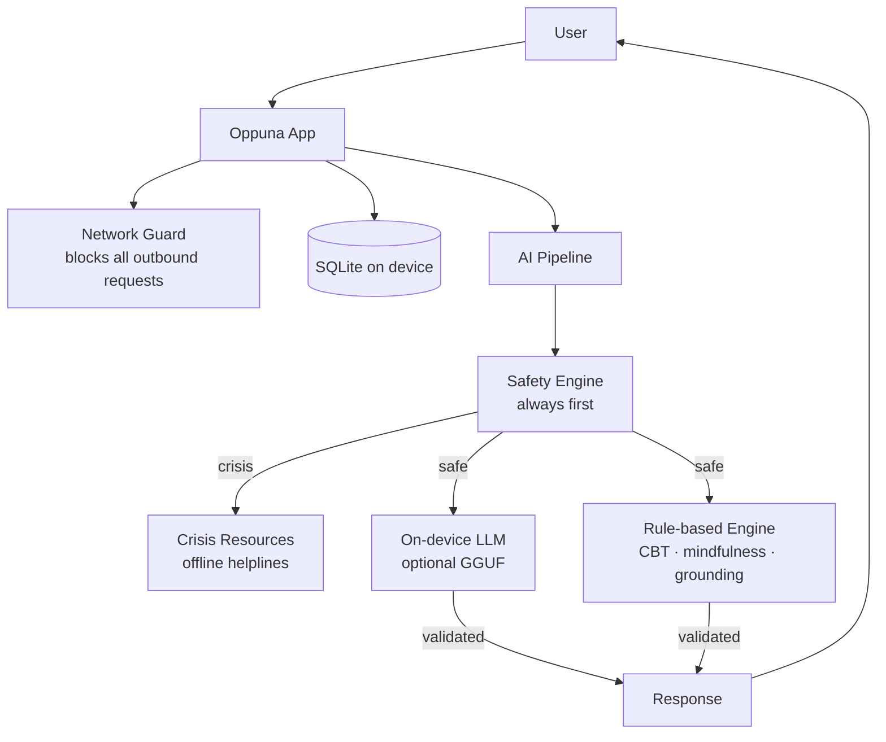

# Oppuna — Investor Pitch Deck

> **Private mental wellness support, fully offline on your phone.**
>
> Slide deck source document. Open `docs/investor-pitch-deck.html` in a browser for the presentation version, or export this file to PDF/Google Slides.

---

## Slide 1 — Cover

**Oppuna** 🌿

*Private mental wellness support, fully offline on your phone.*

- Version 1.0.0 · Production-ready Android build
- [kaushik-i-b/oppuna](https://github.com/kaushik-i-b/oppuna)
- July 2026

---

## Slide 2 — The Problem

### Mental wellness apps ask users to trade privacy for support

| Pain point | Reality today |
|---|---|
| **Privacy erosion** | Most wellness & AI apps require accounts, cloud sync, and analytics |
| **Connectivity dependency** | AI companions fail offline — on planes, in rural areas, during outages |
| **Trust deficit** | Users share their most sensitive thoughts with apps that phone home |
| **Data risk** | Breaches, subpoenas, and ad-targeting pipelines expose emotional data |

> *"I want help, but I don't want my journal on someone's server."*
> — Every privacy-conscious user

**1 in 4** people globally experience a mental health condition. Digital tools are growing fast — but the architecture hasn't caught up to user trust.

---

## Slide 3 — The Solution

### Oppuna: a complete wellness companion that never leaves your device

**No account. No cloud. No internet. Ever.**

A calm, on-device space for:

- Gentle AI conversation (rule-based + optional on-device LLM)
- Mood tracking & weekly insights
- Private journaling (gratitude, thought records, triggers)
- Breathing, grounding, and sleep support
- Crisis safety routing with regional helplines

Works fully in **airplane mode**. Your data never leaves your phone.

---

## Slide 4 — Product Demo

### 18 screens. One cohesive offline experience.

```
Home → Chat → Mood → Journal → Settings
         ↓
  Breathing · Grounding · Sleep · Voice · Insights · Self-care
```

**Investor demo flow (5 minutes):**

1. **Airplane mode on** — show full functionality with zero connectivity
2. **Chat** — mood/intent detection, CBT-style responses, suggestion chips
3. **Crisis flow** — distress language triggers regional helplines (India, US, UK, CA, AU)
4. **Mood → Insights** — log mood, view weekly chart and tag breakdown
5. **Journal** — create a thought record, search, export JSON
6. **Breathing** — animated 4-4-6 / box breathing with haptics
7. **Settings** — biometrics lock, language switch (EN/ES/HI), delete all data

---

## Slide 5 — How It Works

### Privacy by architecture, not policy



**Key technical guarantees:**

- Android `INTERNET` permission explicitly blocked
- Production `fetch` / `XMLHttpRequest` wrapped and rejected
- Safety events log category + timestamp only — never message text
- Full JSON export and permanent delete

---

## Slide 6 — Market Opportunity

### A $9–11B market growing ~15–18% annually

| Metric | Estimate |
|---|---|
| **Global mental health apps (2026)** | ~$9.4–11.4B |
| **Projected (2030–2035)** | $18–41B |
| **CAGR** | 14–18% |
| **Fastest-growing region** | Asia-Pacific |
| **Largest region today** | North America |

**Oppuna's addressable wedge:**

- Privacy-conscious consumers who refuse cloud wellness apps
- Low-connectivity markets (India, rural, travel, emerging markets)
- Multilingual users (EN / ES / HI shipped; architecture ready for more)
- Institutions seeking zero-data-retention wellness tools (schools, NGOs, employers)

*Sources: Mordor Intelligence, Persistence Market Research, Precedence Research (2025–2026 reports)*

---

## Slide 7 — Competitive Landscape

| | Cloud AI apps (Wysa, Woebot) | Meditation apps (Calm, Headspace) | Offline journals | **Oppuna** |
|---|---|---|---|---|
| AI companion | ✅ (cloud) | ❌ | ❌ | ✅ (on-device) |
| Mood + journal | Partial | ❌ | Partial | ✅ |
| Works offline | ❌ | Partial | ✅ | ✅ |
| No account required | ❌ | ❌ | ✅ | ✅ |
| Crisis safety flow | Partial | ❌ | ❌ | ✅ |
| Zero data collection | ❌ | ❌ | ✅ | ✅ |
| Breathing / grounding | Partial | ✅ | ❌ | ✅ |

**Our wedge:** *AI-quality companion + full wellness toolkit + absolute privacy + zero connectivity.*

---

## Slide 8 — Differentiation & Moat

### What competitors can't easily copy

1. **Zero-backend architecture** — no server costs, no breach surface, no latency
2. **Network guard at code level** — privacy enforced by engineering, not a privacy policy
3. **Safety-first AI pipeline** — crisis detection always runs before any LLM or rule engine
4. **Dual AI with validation** — on-device LLM (`llama.rn`) + validated rule fallback; harmful replies discarded
5. **Regional offline crisis resources** — India (KIRAN, Tele-MANAS), US, UK, Canada, Australia
6. **Multilingual from day one** — English, Spanish, Hindi
7. **Full data sovereignty** — export JSON, permanent delete, no vendor lock-in

> *Peace of mind. On your terms. Offline.*

---

## Slide 9 — Business Model

### Aligned with trust — no ads, no data monetization

| Revenue stream | Description | Timeline |
|---|---|---|
| **Freemium app** | Core wellness free; premium features (advanced insights, themes) | Launch |
| **One-time purchase** | Full unlock — privacy users prefer pay-once over subscriptions | Launch |
| **On-device LLM packs** | Optional downloadable model packs (user-owned, no cloud) | Q2 2026 |
| **B2B / institutional** | Schools, NGOs, employers — zero-data wellness for sensitive populations | 2026–2027 |
| **Grants & impact funding** | Mental health + digital privacy + emerging markets alignment | Ongoing |

**Unit economics advantage:** Zero cloud inference costs. Marginal cost per user ≈ $0.

---

## Slide 10 — Traction & Milestones

### Late MVP → pre-launch production-ready

| Milestone | Status |
|---|---|
| **v1.0.0** complete feature set (18 screens) | ✅ Shipped |
| **Android production AAB** signed & documented | ✅ Ready for Play Store |
| **Privacy policy site** (GitHub Pages) | ✅ Live |
| **App Store listing copy** | ✅ Drafted |
| **Unit tests** (AI, crisis, DB) | ✅ 9 test suites |
| **On-device LLM integration** (`llama.rn`) | ✅ Architected |
| **iOS build pipeline** (EAS) | 🔧 Configured |
| **Play Store launch** | 🔜 Next |
| **App Store launch** | 🔜 Next |

**Metrics to track post-launch:** Downloads, DAU/MAU, retention (D7/D30), session length, mood check-ins per user, NPS, premium conversion.

---

## Slide 11 — Technology Stack

| Layer | Choice |
|---|---|
| Mobile | React Native 0.83 + Expo SDK 55 + TypeScript |
| Storage | SQLite (`expo-sqlite`) — 7 tables, versioned migrations |
| State | Zustand + AsyncStorage |
| On-device AI | `llama.rn` (GGUF) + rule-based fallback engine |
| Safety | Dedicated safety engine + response validator |
| Device APIs | TTS, audio recording, haptics, biometrics, secure store |
| Build | EAS Build + local Gradle (production AAB) |
| CI | GitHub Actions (privacy site deploy) |

**Roadmap-ready hooks:** encrypted storage (SQLCipher), on-device STT, additional languages.

---

## Slide 12 — Roadmap

### 12-month product roadmap

| Quarter | Focus |
|---|---|
| **Q3 2026** | Play Store & App Store launch · user acquisition · analytics-free growth loops |
| **Q4 2026** | On-device LLM model packs · encrypted local storage · voice STT |
| **Q1 2027** | 5+ languages · institutional pilot (schools/NGOs) · premium tier |
| **Q2 2027** | B2B dashboard (device-only analytics) · wearable integrations · regional expansion |

**Vision:** Become the default private wellness companion for the 3 billion smartphone users who can't — or won't — trust cloud mental health apps.

---

## Slide 13 — Team

### Built by a privacy-first product engineer

| | |
|---|---|
| **Founder** | [Your Name] — add bio, relevant experience, and photo |
| **GitHub** | [kaushik-i-b](https://github.com/kaushik-i-b) |
| **Repo** | [github.com/kaushik-i-b/oppuna](https://github.com/kaushik-i-b/oppuna) |

**Hiring plan (with funding):**

- Mobile engineer (iOS polish + performance)
- Clinical advisor (wellness content, crisis protocols)
- Growth / community (privacy-conscious mental health audience)
- Localization (India, LATAM, SEA)

---

## Slide 14 — The Ask

### Seed round to launch and scale

| | |
|---|---|
| **Raising** | $[X] seed |
| **Runway** | 18 months |
| **Use of funds** | |

| Allocation | % |
|---|---|
| Product & engineering (iOS, LLM packs, encryption) | 45% |
| Go-to-market (launch, content, community) | 25% |
| Clinical & safety advisory | 10% |
| Localization & regional crisis resources | 10% |
| Legal, compliance & operations | 10% |

**Milestones this round unlocks:**

- 50K+ downloads in year one
- iOS + Android live in 6 markets
- Institutional pilot with 1–2 partners
- Path to $[X] ARR via premium + B2B

---

## Slide 15 — Why Now

1. **On-device AI is ready** — LLMs run on phones (`llama.rn`, Apple Intelligence trend)
2. **Privacy regulation is tightening** — GDPR, DPDP (India), user awareness rising
3. **Mental health demand is surging** — post-pandemic normalization + therapist shortage
4. **Emerging market smartphone growth** — APAC fastest-growing region
5. **Trust backlash against cloud AI** — users want local, controllable AI

---

## Slide 16 — Closing

# Oppuna 🌿

**Peace of mind. On your terms. Offline.**

| | |
|---|---|
| **Product** | Production-ready v1.0.0 |
| **Demo** | Full offline demo available |
| **Contact** | [your@email.com] |
| **Repo** | github.com/kaushik-i-b/oppuna |
| **Privacy** | kaushik-i-b.github.io/oppuna |

*Oppuna is a wellness companion, not a medical device. It does not diagnose, treat, or replace professional care.*

---

## Appendix A — Feature Inventory

- Offline AI companion (rule-based + optional on-device LLM)
- Crisis safety flow (suicide, self-harm, abuse, violence, medical emergency, severe panic)
- Mood tracker (5 moods, 1–10 intensity, tags, weekly chart)
- Journal (daily, gratitude, thought records, triggers, private notes)
- Breathing (4-4-6, box, 5-minute calm)
- Grounding (5-4-3-2-1 senses)
- Sleep support (wind-down checklist + TTS)
- Voice mode (TTS + local voice notes)
- Self-care plan & insights dashboard
- App lock (biometrics/PIN)
- Data export (JSON) & permanent delete
- Dark/light/system themes
- Multilingual (EN, ES, HI)

## Appendix B — Database Schema

`mood_entries` · `journal_entries` · `chat_sessions` · `chat_messages` · `breathing_sessions` · `safety_events` · `voice_notes`

## Appendix C — Crisis Resources (Offline)

India (default): KIRAN 18005990019, Tele-MANAS 14416, AASRA, iCall, Vandrevala Foundation
US · UK · Canada · Australia · International helplines bundled
