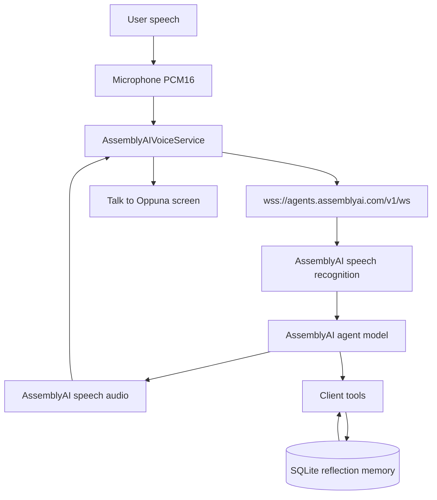

# Talk to Oppuna — voice architecture

This document records the architecture that already exists in Oppuna and the smallest set of additions for the AssemblyAI voice experience. It is the plan that the implementation follows.

## What already exists

Oppuna is a React Native + Expo SDK 55 app (TypeScript, React 19). It is a privacy-first wellness companion. The shipped Android configuration blocks `android.permission.INTERNET`. A JavaScript network guard (`src/services/networkGuard.ts`) rejects outbound `fetch` / `XMLHttpRequest` to public hosts. Local Metro hosts are allowed only in development.

| Area | Where it lives | What it does |
| --- | --- | --- |
| Framework | Expo 55, React Native 0.83, `react-native-web` | One codebase for Android, iOS, and web |
| Navigation | `@react-navigation/native-stack` + bottom tabs (`src/navigation`) | Home, Plan, Journal, Chat, Profile, plus pushed screens |
| Chat | `src/screens/chat/ChatScreen.tsx`, `src/ai/*` | On-device companion. Crisis check runs before generation. Streaming local LLM via `llama.rn`, with a rule-based fallback |
| Voice notes | `src/screens/chat/VoiceModeScreen.tsx` | Offline guides (device TTS) and local microphone recordings stored in `voice_notes`. This is press-to-record, not a live conversation |
| Journal | `journal_entries` + `journalRepository` | Daily, gratitude, thought records, triggers, notes |
| Mood | `mood_entries` + `moodRepository` | Mood key, intensity 1–10, note, tags, weekly insight helpers |
| State | Zustand `settingsStore` for preferences; screen-local React state for chat | No global chat server |
| Auth | None | Single device, no account |
| Persistence | `expo-sqlite` (`oppuna.db`), migrations in `src/database/schema.ts` | `PRAGMA user_version`, append-only migrations |
| Safety | `src/ai/safetyEngine.ts`, `CrisisScreen` | Conservative crisis detection. Safety events store category and time only, never the message text |
| Privacy | Network guard, blocked INTERNET on Android production builds, backup disabled, FLAG_SECURE on sensitive screens | Journaling and on-device AI do not call the network |

There is no AssemblyAI dependency in the repository today. Chat and voice notes stay as they are.

## Minimum change

Talk to Oppuna is a new full-screen flow. It does not replace the on-device companion, the journal, or voice notes.

1. A local token server holds `ASSEMBLYAI_API_KEY` and mints a one-time Voice Agent token (`GET https://agents.assemblyai.com/v1/token`).
2. The app opens `wss://agents.assemblyai.com/v1/ws?token=...` and sends `session.update` with an inline agent (prompt, tools, PCM input/output, barge-in).
3. The browser streams 24 kHz PCM16 microphone audio as `input.audio` and plays `reply.audio`. Turn detection and barge-in are AssemblyAI's.
4. Tools run on device against SQLite. Only user-approved memory is readable later.
5. The existing network guard stays in place. A voice session may allow the token host and `agents.assemblyai.com` for the token request only. Every other public host stays blocked. Android production builds still strip `INTERNET`; the live demo path is Expo web or Expo Go, where the process is allowed to use the network.

## AssemblyAI contract in use

Source: AssemblyAI Voice Agent API (2026).

| Step | Message |
| --- | --- |
| Auth | Server `GET /v1/token` with the API key. Client connects with `?token=` |
| Configure | Client `session.update` (inline `system_prompt`, `tools`, `input`, `output`) |
| Ready | Server `session.ready` |
| Mic | Client `input.audio` (base64 PCM16, 24 kHz) |
| Turns | `input.speech.started`, `transcript.user.delta`, `input.speech.stopped`, `transcript.user` |
| Reply | `reply.started`, `reply.audio`, `transcript.agent`, `reply.done` (`status`: `completed` or `interrupted`) |
| Tools | Server `tool.call`. Client `tool.result` after `reply.done` |
| Resume | `session.resume` with `session_id` if the socket drops (30s grace) |
| End | Client `session.end`, then server `session.ended` |

The client never contains the API key. Responses are not scripted. If the token server or socket fails, the screen shows an error and a retry.

## State machine

One phase at a time: `IDLE`, `CONNECTING`, `LISTENING`, `THINKING`, `SPEAKING`, `INTERRUPTED`, `SAVING`, `ERROR`.

Barge-in: `SPEAKING` + user speech → `INTERRUPTED`, playback queue cleared, then `LISTENING`. Audio from the interrupted reply is dropped. Timeouts leave `CONNECTING`, `THINKING`, and `SAVING` so the UI cannot sit there forever.

## Memory model

Session transcript rows are temporary conversation context. Long-term memory is a separate `reflection_memories` row.

`save_reflection` stores a draft (`user_approved = 0`) after stripping `excludedTopics`. The person approves individual memory lines on screen. Future `get_recent_reflections` returns only approved lines. `get_reflection_patterns` returns trends only when at least two approved reflections exist in the requested window. Otherwise it says there is not enough data.

Forget this conversation deletes this session's transcript and any unsaved draft. It does not delete approved memories from other sessions.

## Demo seed

An explicit development control can insert rows flagged `demo_seed`. It does not simulate AssemblyAI. Production sessions read the same tables and simply find no seed unless that control was used.

## Safety

Final user transcripts still pass through `assessSafety`. A crisis match stops the voice session and opens the existing crisis screen. The system prompt forbids diagnosis and therapeutic or medical claims. The safety engine is unchanged.
